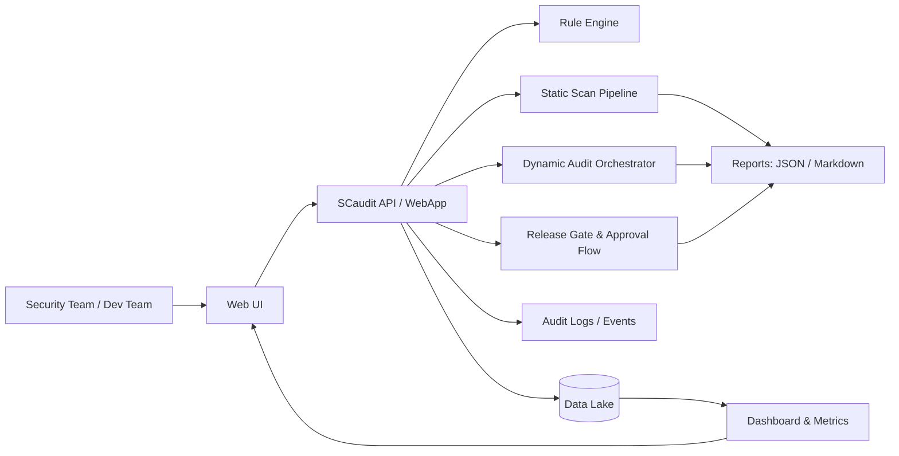
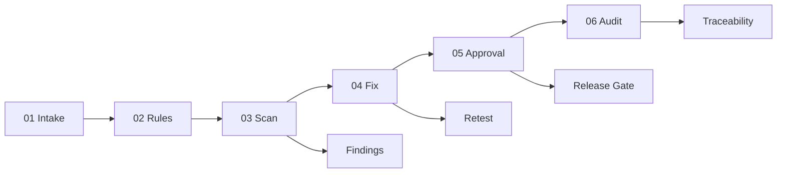

# Web3-Security

A practical **Web3 security engineering monorepo** that combines:
- a full security platform (`scaudit-refactored`),
- a deployable website/admin demo,
- and real working materials for audit, threat modeling, and compliance.

[](./LICENSE)
[](https://go.dev/)
[](https://vuejs.org/)
[](#repository-structure)

**[中文文档](./README.zh-CN.md)**

## Why This Repo Stands Out

- **End-to-end security lifecycle**: intake -> rules -> scan -> fix -> approval -> audit.
- **Platform-level implementation**: not only scanners, but also governance, release gates, and workflow controls.
- **Evidence-backed engineering**: code, reports, templates, and operational artifacts live in one repository.

## Architecture Overview



## Security Delivery Flow



## Repository Structure

```text
Web3-Security/
├── scaudit-refactored/           # Main security platform (Go)
├── official-website-demo/        # Vue3 + Go website/admin demo
├── code-audit-materials/         # Audit spreadsheets / references
├── threat-modeling-materials/    # Threat-modeling templates
├── compliance-materials/         # Compliance and logging docs
├── SDLC_DevSecOps_Optimization_Plan.md
├── CONTRIBUTING.md
├── LICENSE
└── README.md
```

## Capability Map

| Area | What You Get | Location |
|------|---------------|----------|
| Platform Core | Security management platform, API, rules, scans | `scaudit-refactored/internal/` |
| Operations UI | Dashboard, workflow views, approval pages | `scaudit-refactored/internal/webapp/` |
| Security Workflow | Findings, suppressions, release gates, production confirmation | `scaudit-refactored/data/lake/` + `internal/webapp/` |
| Website Demo | Public site + admin panel + Docker deployment | `official-website-demo/` |
| Security Assets | Audit / threat / compliance artifacts | `code-audit-materials/`, `threat-modeling-materials/`, `compliance-materials/` |

## Quick Start

### 1) Run the security platform

```bash
cd scaudit-refactored
make run
```

### 2) Run the website demo

```bash
cd official-website-demo
docker compose up -d --build
```

## Recommended Demo Path

1. Start `scaudit-refactored` and open dashboard/settings/audit modules.
2. Run a sample scan and inspect generated reports.
3. Walk through approval/release-gate workflow.
4. Show website demo deployment with Docker.

## Open Source Baseline

This repository includes:
- `README.md` (architecture, usage, capability map)
- `LICENSE` (MIT)
- `CONTRIBUTING.md`
- `.gitignore`

## Contributing

See [CONTRIBUTING.md](./CONTRIBUTING.md).

## License

MIT License. See [LICENSE](./LICENSE).
