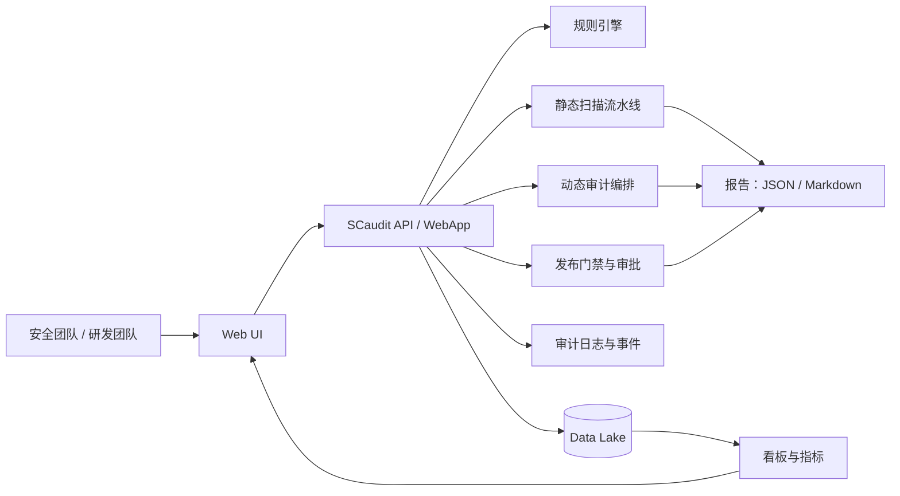
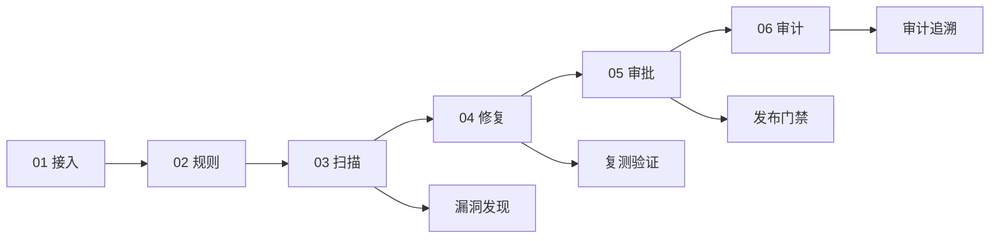

# Web3-Security（中文文档）

这是一个面向 **Web3 安全工程落地** 的 Monorepo，集成了：
- 安全平台代码（`scaudit-refactored`）
- 可部署的网站与后台 Demo（`official-website-demo`）
- 代码审计 / 威胁建模 / 合规资料

[](./LICENSE)
[](https://go.dev/)
[](https://vuejs.org/)
[](#仓库结构)

## 项目亮点

- **全链路安全闭环**：接入 -> 规则 -> 扫描 -> 修复 -> 审批 -> 审计  
- **平台化能力**：不仅是扫描器，还包含治理、门禁、审批与追踪  
- **证据可回溯**：代码、报告、模板、运行数据统一沉淀在仓库中

## 架构总览



## 安全交付流程



## 仓库结构

```text
Web3-Security/
├── scaudit-refactored/           # 安全平台主代码（Go）
├── official-website-demo/        # 官网 + 管理后台 Demo（Vue3 + Go）
├── code-audit-materials/         # 代码审计资料
├── threat-modeling-materials/    # 威胁建模资料
├── compliance-materials/         # 合规与日志接入资料
├── SDLC_DevSecOps_Optimization_Plan.md
├── CONTRIBUTING.md
├── LICENSE
└── README.md
```

## 能力矩阵

| 能力域 | 内容 | 路径 |
|---|---|---|
| 平台核心 | 安全管理平台、API、规则与扫描 | `scaudit-refactored/internal/` |
| 运营界面 | 首页看板、流程视图、审批页面 | `scaudit-refactored/internal/webapp/` |
| 治理流程 | 漏洞案例、抑制治理、发布门禁、投产确认 | `scaudit-refactored/data/lake/` + `internal/webapp/` |
| 官网 Demo | 官网与后台、Docker 部署 | `official-website-demo/` |
| 安全资料 | 审计/威胁建模/合规文档 | `code-audit-materials/` 等 |

## 快速开始

### 1) 启动安全平台

```bash
cd scaudit-refactored
make run
```

### 2) 启动官网 Demo

```bash
cd official-website-demo
docker compose up -d --build
```

## 推荐演示路径

1. 启动 `scaudit-refactored`，展示首页 / 配置 / 审计模块。  
2. 运行样例扫描并查看报告输出。  
3. 展示审批与发布门禁流程。  
4. 演示官网与后台一键部署。  

## 开源基线

仓库包含：
- `README.md` / `README.zh-CN.md`
- `LICENSE`（MIT）
- `CONTRIBUTING.md`
- `.gitignore`

## 贡献指南

见 [CONTRIBUTING.md](./CONTRIBUTING.md)。

## 许可证

MIT，详见 [LICENSE](./LICENSE)。

